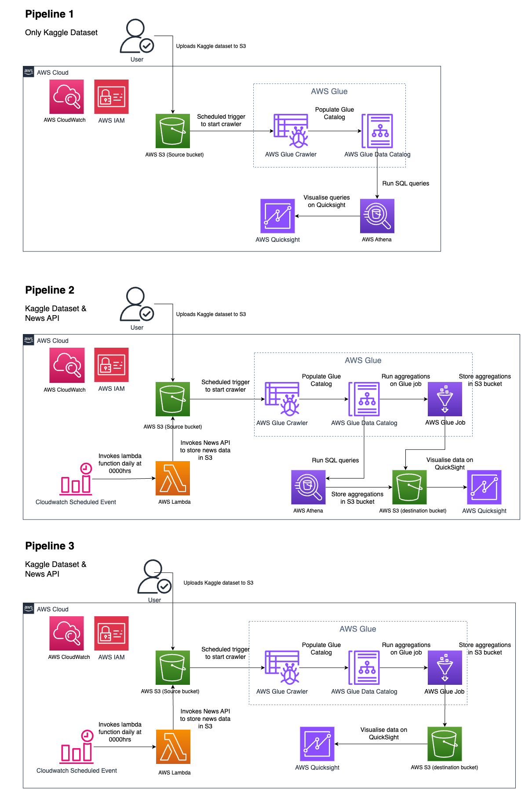

# Solving business questions with news category data set

## Fields of the dataset

For each article the attribute are as follows:
| Attribute | Attribute |Description |
|------------------- |--------------------|--------------------|
| category |string| category article belongs to |
| headline |string| headline of the article |
| authors |string| person authored the article |
| link |string| link to the post |
| short_description |string| short description of the article |
| date |string| date the article was published|

## Fields of supplementary data from news api

Source: https://newsapi.org/
For each article the attribute are as follows:
| Attribute | Attribute | Description|
|------------------- |--------------------| --------------------|
|source_id |string| id of news agency|
|source_name |string| name of news agency|
|author |string| author of article|
|title |string| title of article|
|description |string| description of article|
|url |string| url to article|
|urltoimage |string| url to image|
|publishedat |string| when was the article published|

## Business question 1:

**Business Question:** Can we visualize the distribution of the top 5 categories of articles by year in HuffPost? <br/>
**Target beneficiary:** HuffPost<br/>
**How does it help?** This helps HuffPost to understand the trend of the top 5 categories of articles by year.
This can help them to focus on the categories that are trending and produce more articles on those categories.

## Business question 2:

**Business Question:** Can we visualize the number of articles produced each year by various news agencies?<br/>
**Target beneficiary:** News Agencies<br/>
**How does it help?** This helps news agencies to understand the trend of the number of articles produced each year.
This can help them to focus on the years that have the highest number of articles produced and produce more articles in those years.

## Business question 3:

**Business Question:** Can we identify what words are commonly used for headlines? <br/>
**Target beneficiary:** Article authors<br/>
**How does it help?** This helps article authors to understand what words are commonly used for headlines.
This can help them to spend less time thinking of a great headline and spend more time refining their article.

---

## Repository Orientation

- **data folder**
  - contains the data set from Kaggle
  - contains SQL queries for the data set used in Athena
  - contains the image for the pipelines' AWS architectures
- **glue folder**
  - contains the code for the glue crawler and glue ETL job
- **lambda folder**
  - contains the "get_news" folder for the lambda function
    - contains the code for the lambda function (Data Ingestion)
    - contains readme for installing the dependencies
    - readme also contains the code for the lambda function if subscribed to paid subscription
- **terraform folder**
  - contains the terraform code for the architecture
- **visualizations folder**
  - contains the manifest file for the visualizations on QuickSight

---

## How to set up the project

1. Clone the repository
2. cd to `lambda/get_news directory`, and read the readme.md there before proceeding to the next step
3. Under the terraform directory, create a terraform.tfvars file with the following content:

```
AWS_ACCESS_KEY_ID     = "your_aws_access_key_id"
AWS_SECRET_ACCESS_KEY = "your_aws_secret_access_key"
NEWS_API_KEY          = "your_news_api_key"
AWS_ACCOUNT_ID        = "your_aws_account_id"
AWS_REGION            = "your_aws_region"
```

- :memo: **Note:** the news api key can be retrieved from https://newsapi.org/

3. Run the following commands:

```
cd terraform
terraform init
terraform apply
```

4. Once the terraform is applied, the architecture will be created in AWS.
   The pipelines are linked to the business questions.
   

5. To tear down the architecture, run the following command:

```
cd terraform
terraform destroy
```

### Other Details

**Data Ingestion:**
Batch (AWS Lambda)

**Data Processing:**
Batch (AWS Glue)

**For the scheduled triggers:**

- 1200 daily => lambda get_news
- 1220 daily => glue crawler
- 1240 daily => glue ETL job

### Limitations

The API key for News API is a free tier key, which means that it is limited to 100 requests per day.
This means that the data ingestion is limited to 100 articles per day and it will not contain data for the past years.
Will require a paid subscription to News API to get more data -> code prepared in /lambda/readme.md if subscribed to paid subscription

### Points for improvement

Suboptimal data ingestion of Kaggle Data Set through:

1. Manual downloading of Kaggle dataset and uploading to S3
2. Manual downloading of Kaggle dataset, replacing it in the code base and run `terraform apply`

**Improvement:**
Using EC2 or a Lambda function to automate this process in the future

---

# Learning Points

1. Deeper understanding of big data pipelines
2. Using Terraform for big data pipelines
3. Using AWS Glue, Athena, QuickSight
4. Exploring PySpark’s functions like ML & SQL

---

**Citation of data sources:**

1. Misra, Rishabh. "News Category Dataset." arXiv preprint arXiv:2209.11429 (2022).
2. Misra, Rishabh and Jigyasa Grover. "Sculpting Data for ML: The first act of Machine Learning." ISBN 9798585463570 (2021).
3. https://www.kaggle.com/datasets/rmisra/news-category-dataset
